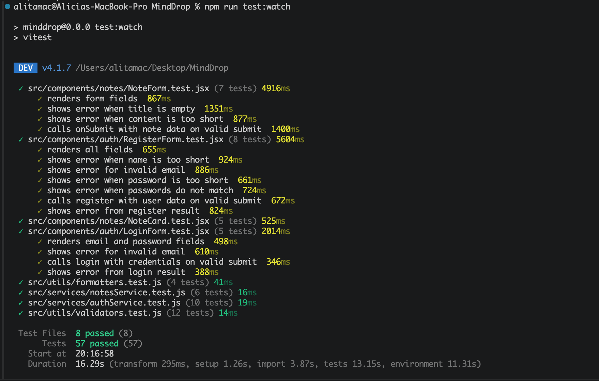
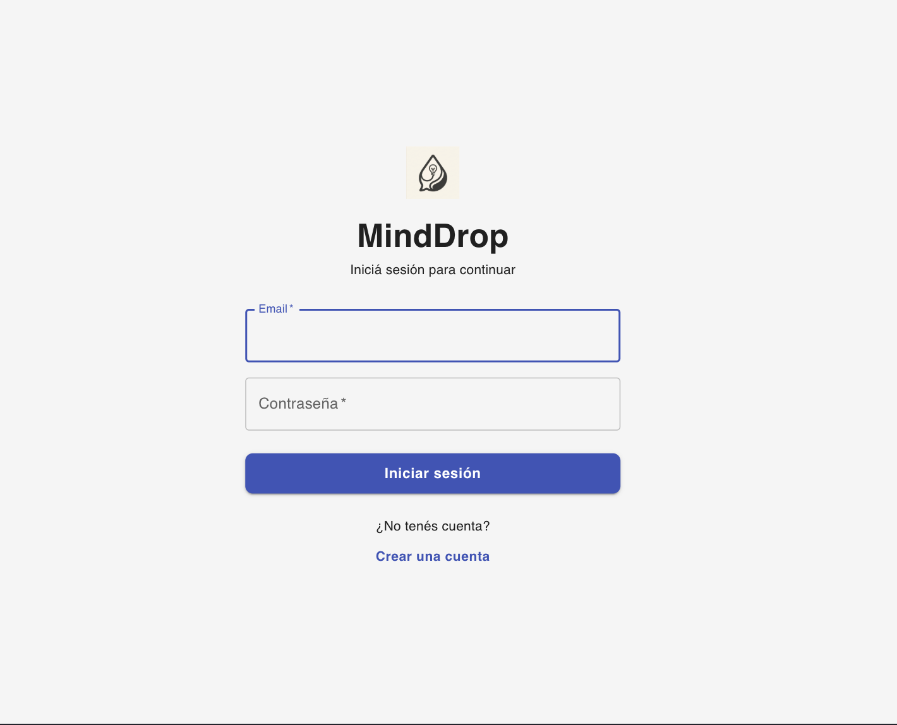
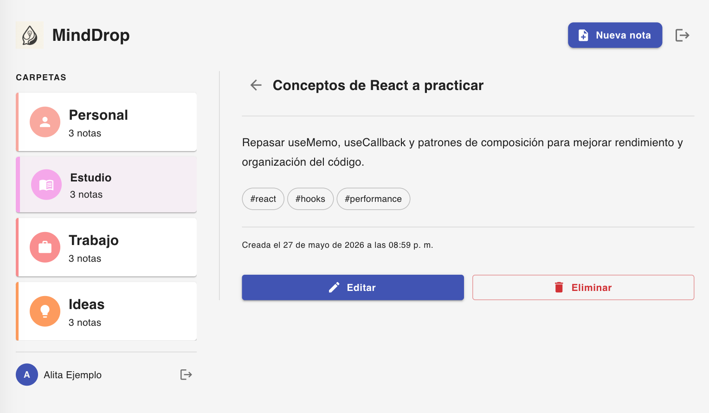

# MindDrop

Aplicación web de notas personales que permite crear, editar, eliminar y categorizar notas con una interfaz intuitiva y organizada.

## **Despliegue en producción:**

[](https://mind-drop-alizunegas-projects.vercel.app/)

## Stack Tecnológico

- **React** para componentes y hooks
- **Vite** para build y dev server
- **Material UI** y **CSS** para estilos
- **Context API** para manejo de estado global
- **Vitest + React Testing Library** para tests unitarios y de integración
- **localStorage** para persistencia de datos local y sesión de usuario

---

## Instalación y configuración

1. Clona el repositorio:

```bash
git clone https://github.com/ali-zunega/MindDrop.git
```

2. Navega a la carpeta del proyecto:

```bash
cd MindDrop
```

3. Instala dependencias:

```bash
npm install
```

4. Ejecuta el servidor de desarrollo:

```bash
npm run dev
```

La aplicación se abrirá en `http://localhost:5173`.

---

## Scripts

| Comando              | Descripción                           |
| -------------------- | ------------------------------------- |
| `npm run dev`        | Inicia el servidor de desarrollo      |
| `npm run build`      | Compila para producción               |
| `npm run preview`    | Previsualiza el build                 |
| `npm run lint`       | Ejecuta ESLint                        |
| `npm run test`       | Ejecuta la suite de pruebas (una vez) |
| `npm run test:watch` | Ejecuta los tests en modo watch       |

---

## Estructura del proyecto

```bash
src/
├── __tests__/         # Tests
│   ├── setup.js
│   ├── components/
│   │   ├── auth/      #   LoginForm.test.jsx, RegisterForm.test.jsx
│   │   └── notes/     #   NoteForm.test.jsx, NoteCard.test.jsx
│   ├── services/      #   authService.test.js, notesService.test.js
│   └── utils/         #   validators.test.js, formatters.test.js
├── components/        # Componentes de la UI
│   ├── auth/          #   LoginForm, RegisterForm
│   ├── folders/       #   FolderCard, FolderList
│   └── notes/         #   NoteCard, NoteForm, NoteDetail, NotesList, SearchBar, DeleteConfirmDialog
├── context/           # Estado global de la app
│   ├── AuthProvider.jsx
│   ├── authContext.js
│   ├── NotesProvider.jsx
│   └── notesContext.js
├── hooks/             # Custom hooks
│   ├── useAuth.js
│   └── useNotes.js
├── mocks/             # Datos mock iniciales
│   ├── categories.js
│   ├── initialNotes.js
│   └── users.js
├── services/          # Persistencia en localStorage
│   ├── authService.js
│   └── notesService.js
├── utils/             # Utilidades compartidas
│   ├── formatters.js  #   formatDate, formatDateLong, getInitial
│   └── validators.js  #   isValidEmail, minLength, validateNoteForm
├── views/             # Vistas principales
│   ├── Dashboard.jsx
│   ├── Login.jsx
│   └── Register.jsx
├── App.jsx
└── main.jsx
```

---

## Funcionalidades

- Autenticación de usuarios (registro, inicio y cierre de sesión)
- CRUD completo de notas (crear, leer, actualizar, eliminar)
- Navegación por carpetas con categorías fijas (Personal, Estudio, Trabajo, Ideas) y filtro por categoría
- Búsqueda de notas por título y contenido
- Etiquetas (tags) libres por nota
- Vista de lista con preview: título, tags y fecha de creación/modificación
- Vista detalle con contenido completo, tags, fechas y botones editar/eliminar
- Sidebar con carpetas en desktop para navegación persistente
- Mobile-first con diseño responsive y FAB
- Persistencia local con localStorage
- Datos mock iniciales al primer uso

---

## Modelo de datos

### user

```json
{
  "id": "user-1",
  "name": "Alita Ejemplo",
  "email": "ali@minddrop.com",
  "password": "123456"
}
```

Campos y tipos de datos:

- **id**: `string` (UUID único del usuario)
- **name**: `string`
- **email**: `string`
- **password**: `string` (sin hashing — demo)

### note

```json
{
  "id": "note-001",
  "title": "Ideas para el próximo deploy",
  "content": "Revisar las variables de entorno en Vercel.",
  "categoryId": "cat-work",
  "tags": ["deploy", "backend"],
  "createdAt": "2026-05-20T23:00:00.000Z",
  "updatedAt": "2026-05-20T23:30:00.000Z"
}
```

Campos y tipos de datos:

- **id**: `string` (UUID único de la nota)
- **title**: `string`
- **content**: `string`
- **categoryId**: `string | null` (Relación con `category.id`)
- **tags**: `string[]` (Etiquetas libres)
- **createdAt**: `string` (Formato ISO 8601 — fecha de creación)
- **updatedAt**: `string` (Formato ISO 8601 — fecha de última modificación)

### category

```json
{
  "id": "cat-work",
  "name": "Trabajo",
  "slug": "trabajo",
  "color": "#3f51b5",
  "icon": "briefcase"
}
```

Campos y tipos de datos:

- **id**: `string` (UUID único de la categoría)
- **name**: `string` (Personal | Estudio | Trabajo | Ideas)
- **slug**: `string`
- **color**: `string` (Código hexadecimal, ej. `#3f51b5`)
- **icon**: `string` (user | book | briefcase | lightbulb | folder)

---

## Tests

El proyecto usa **Vitest** con **React Testing Library** y **jsdom** para pruebas unitarias y de integración.

### Stack de testing

- **Vitest** — corredor de tests (compatible con Vite)
- **@testing-library/react** — renderizado de componentes en entorno simulado
- **@testing-library/user-event** — interacciones realistas (click, type, etc.)
- **@testing-library/jest-dom** — matchers adicionales (`toBeInTheDocument`, `toHaveTextContent`, etc.)
- **jsdom** — entorno DOM simulado para Node.js

### Tests incluidos

| Archivo                                 | Tipo        | Qué verifica                                                                        |
| --------------------------------------- | ----------- | ----------------------------------------------------------------------------------- |
| `services/authService.test.js`          | Unitario    | login, register, logout, initUsers, sesión en localStorage                          |
| `services/notesService.test.js`         | Unitario    | loadNotes con/sin datos, migración de clave antigua, saveNotes                      |
| `utils/validators.test.js`              | Unitario    | isValidEmail, minLength, validateRequired, validateNoteForm                         |
| `utils/formatters.test.js`              | Unitario    | formatDate, formatDateLong, getInitial, nowISO                                      |
| `components/auth/LoginForm.test.jsx`    | Integración | render, validaciones vacío/email inválido, submit exitoso, error del contexto       |
| `components/auth/RegisterForm.test.jsx` | Integración | render, validaciones (nombre corto, email, contraseña, confirmación), submit, error |
| `components/notes/NoteForm.test.jsx`    | Integración | render, validaciones título/contenido, submit, pre-fill en edición                  |
| `components/notes/NoteCard.test.jsx`    | Render      | título, tags, fechas, clic, sin tags                                                |

---

### Ejecutar tests

```bash
# Una vez (modo CI)
npm run test

# Modo watch (se re-ejecutan al cambiar archivos)
npm run test:watch
```



---

### Screenshots

| Vista                  | Preview                                                                         |
| ---------------------- | ------------------------------------------------------------------------------- |
| Inicio de sesión       |               |
| Dashboard con carpetas |  |

---

## Decisiones de Diseño

### ¿Por qué usamos Context API?

Se eligió **Context API** porque es la herramienta nativa de React para compartir información entre componentes sin complicaciones.

- **Evita pasar datos "mano en mano"**: Componentes como el formulario y la lista de notas acceden al mismo estado sin prop drilling.
- **Sin código de más**: A diferencia de Redux, Context no requiere configuración compleja ni librerías extra.
- **Guardado automático**: Centraliza la lectura y escritura con `localStorage` de forma limpia.

### ¿Por qué usar Carpetas + Etiquetas (Tags)?

Se optó por un sistema mixto para organizar las notas de forma intuitiva sin saturar al usuario:

- **Carpetas por categoría**: 4 bloques (_Personal, Estudio, Trabajo, Ideas_) más una carpeta virtual _Sin categoría_. Cada nota pertenece a una sola y se accede a través de la navegación por carpetas.
- **Etiquetas libres**: Los tags (`#importante`, `#codigo`) son transversales y conectan notas de diferentes carpetas.
